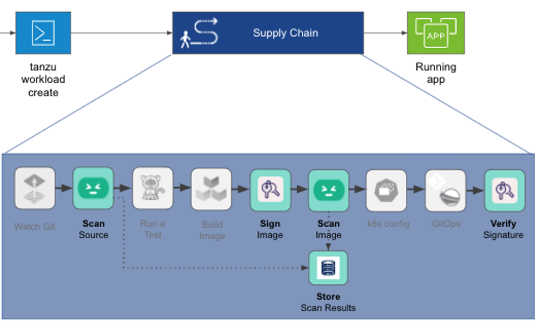

**Supply Chain Choreographer** is based on open source [Cartographer](https://cartographer.sh). It allows App Operators to create pre-approved paths to production by integrating Kubernetes resources with the elements of their existing toolchains, for example, Jenkins.

Each pre-approved supply chain creates a paved road to production. Orchestrating supply chain resources - test, build, scan, and deploy - allows developers to focus on delivering value to their users and provides App Operators the assurance that all code in production has passed through all the steps of an approved workflow.

**Out of the box supply chains provided with VMware Tanzu Application Platform:**
- Out of the Box Supply Chain Basic
- Out of the Box Supply Chain with Testing
- Out of the Box Supply Chain with Testing and Scanning



Let's now explore our **Supply Chain with Testing and Scanning** we are using for "web-app" applications:
```editor:open-file
file: supplychain/
```
**Monitoring Supply Chain Execution**

The logs in the bottom terminal window show the progress of supply chain execution. When the build is complete, the container images are stored in a Harbor registry, from which deployment operations will pull those images. Let's now look at how TAP automates the deployment and execution of our application.
